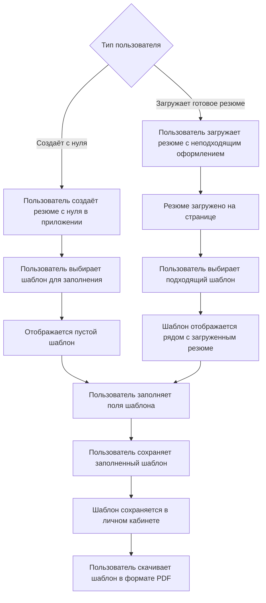

# ConResEd
*Конвертер и редактор резюме*

# Пользователь
Как пользователь, который создаёт своё резюме, я не хочу тратить много времени и сил на оформление резюме – куда проще использовать уже готовые шаблоны.

Как пользователь, который недоволен оформлением своего резюме, я хочу очень просто перенести всю информацию в красивый формат, чтобы привлечь внимание работодателя.

# Функции приложения
1. Перенос резюме: Загрузка изначального файла с резюме, который будет располагаться рядом с выбранным шаблоном. Далее пользователь может легко перенести всю информацию из файла в поля шаблона.

2. Редактор резюме: Пользователь выбирает подходящий для него шаблон резюме и заполняет поля шаблона информацией о себе.

3. Библиотека шаблонов: Пользователь выбирает варианты визуального оформления из 3-5 готовых стилей с возможностью предпросмотра до применения.

4. Сохранение и экспорт:
- Автосохранение черновиков в личном кабинете пользователя.
- Возможность создавать несколько версий резюме (под разные вакансии).
- Экспорт в PDF одним кликом с идеальным сохранением верстки.

5. Хранение шаблонов на бэкенде. Таким образом пользователь не потеряет свои резюме, и будет иметь доступ к ним с нескольких устройств.

# Полный функциональный цикл

