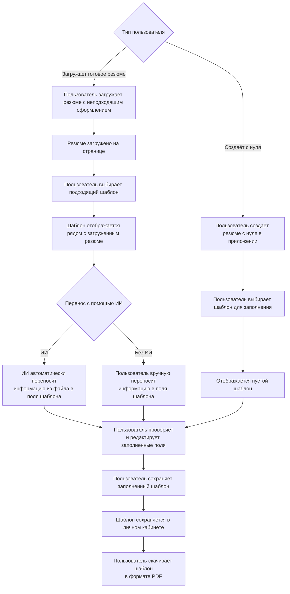

# ConResEd
*Конвертер и редактор резюме*

# Пользователь
Как пользователь, который создаёт своё резюме, я не хочу тратить много времени и сил на оформление резюме – куда проще использовать уже готовые шаблоны.

Как пользователь, который недоволен оформлением своего резюме, я хочу очень просто перенести всю информацию в красивый формат, чтобы привлечь внимание работодателя.

# Функции приложения
1. Перенос резюме
Загрузка изначального файла с резюме, который будет располагаться рядом с выбранным шаблоном. Далее пользователь может:
- Вручную перенести информацию из файла в поля шаблона.
- Искусственный интеллект автоматически распознаёт данные из загруженного файла и заполняет поля выбранного шаблона, после чего пользователь может проверить и при необходимости отредактировать результат.

2. Редактор резюме
Пользователь выбирает подходящий для него шаблон резюме и заполняет поля шаблона информацией о себе. Поддерживается:
- Создание и редактирование нескольких версий резюме одновременно (под разные вакансии или для A/B-тестирования оформления).
- Быстрое переключение между версиями внутри редактора.
- Клонирование существующей версии для создания новой на её основе.

3. Библиотека шаблонов
Пользователь выбирает варианты визуального оформления из 3–5 готовых стилей с возможностью предпросмотра до применения.

5. Сохранение и экспорт
- Автосохранение черновиков в личном кабинете пользователя.
- Возможность создавать несколько версий резюме (под разные вакансии) с раздельным хранением и управлением.
- Экспорт в PDF одним кликом с идеальным сохранением верстки для каждой версии резюме.

5. Хранение шаблонов на бэкенде
Таким образом пользователь не потеряет свои резюме, и будет иметь доступ к ним с нескольких устройств. Все созданные версии резюме синхронизируются между устройствами пользователя.

# Полный функциональный цикл
